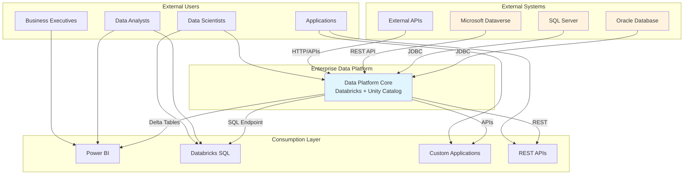
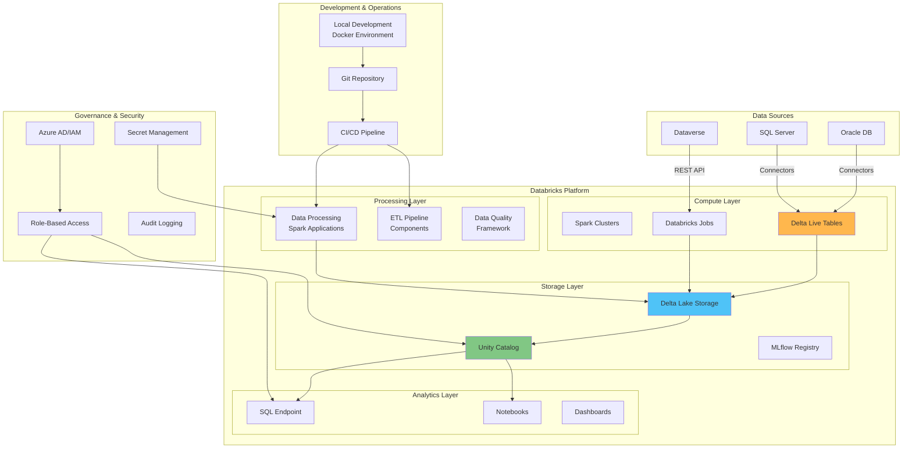
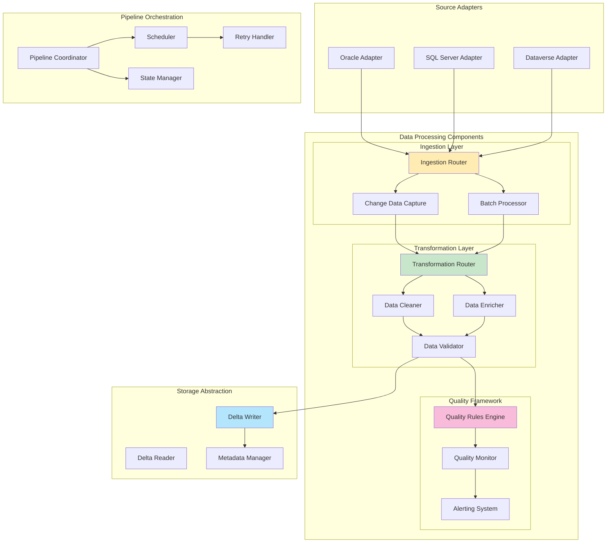
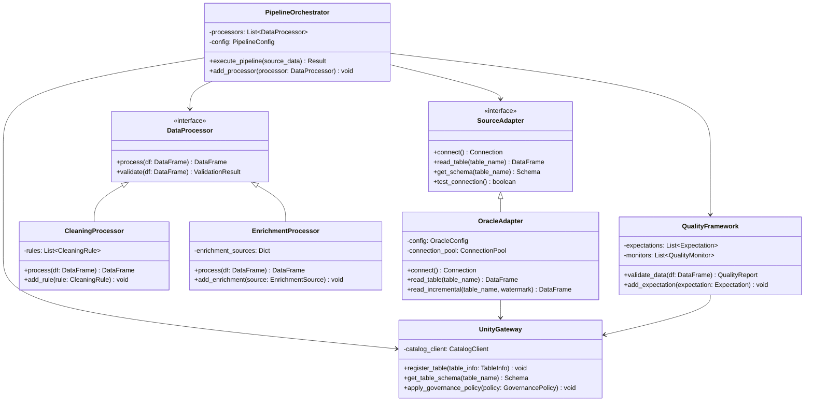
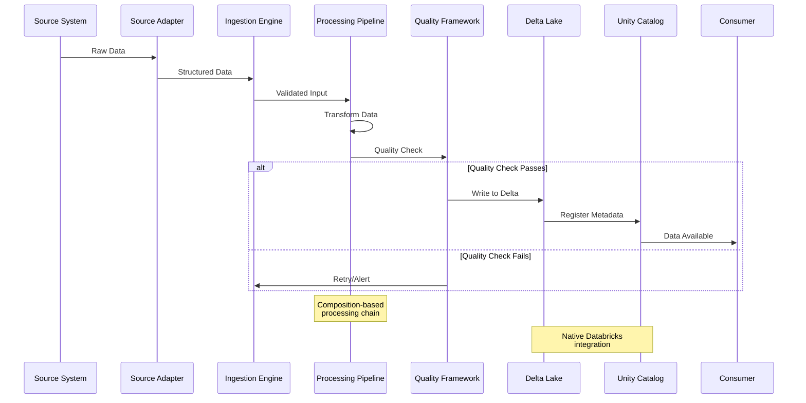
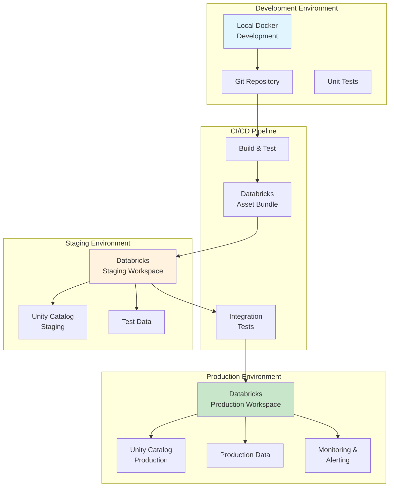
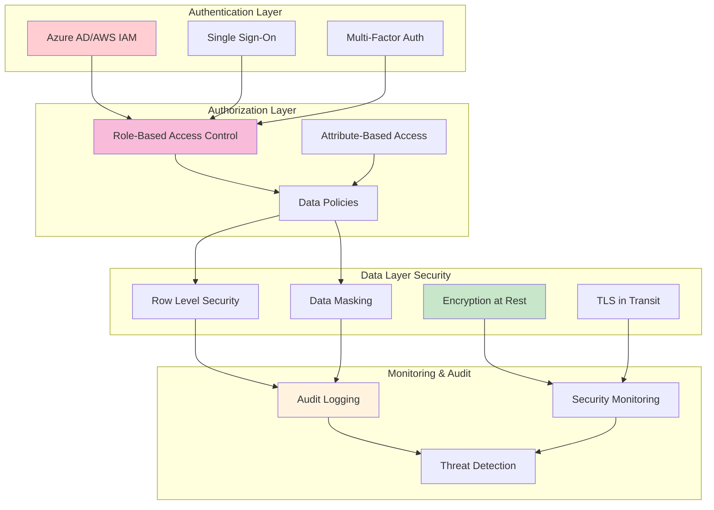
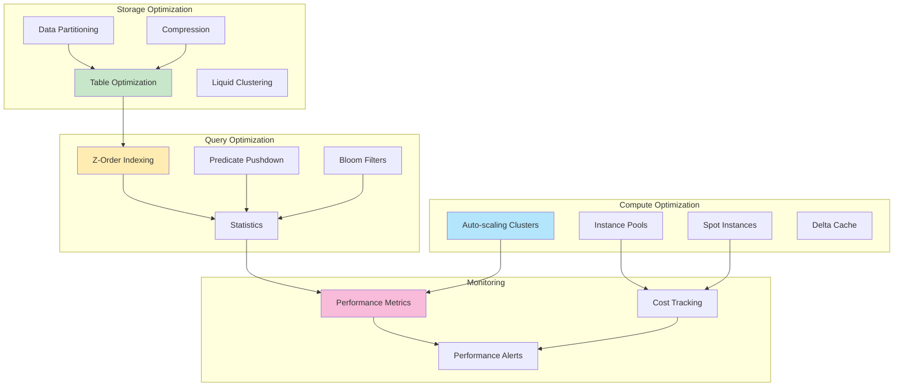

# C4 Model Architectural Diagrams

## Level 1: System Context Diagram

## Level 2: Container Diagram

## Level 3: Component Diagram - Data Processing Layer

## Level 4: Code Structure - Component Implementation

## Data Flow Diagram

## Deployment Architecture

## Security Architecture

## Performance Architecture

These diagrams provide a comprehensive view of the enterprise data platform architecture at multiple levels of detail, following C4 model conventions for clear communication with stakeholders.